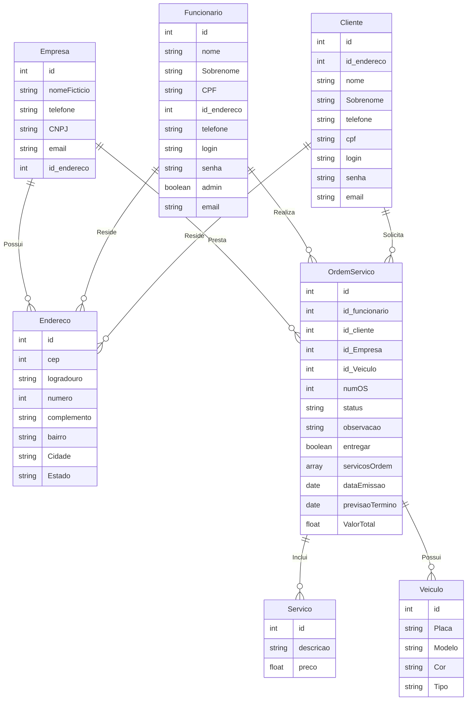

# Projeto-Sistema-LavaJato

Ola meu nome é Rauner!
Este Projeto foi feito com trabaho final da materia de Prgoramação pra Web 1, 
em minha faculdade. 

## Um Pouco sobre o projeto 

Este projeto tem como abjetivo mostra que aprendi lidadar com algun padrões de projeto
como o DAO, MVC, entre outras coisa, para que fique um pouco mais claro algumas da
exigencias do projeto são:  

* Utilize o padrão de arquitetura MVC;
* Utilize páginas JSP para fazer a View;
* Não utilize scriptless nem expressão nas páginas JSP;
* Utilize o padrão de projeto DAO;
* Utilize banco de dados relacional para fazer a persistência dos dados;
* Usuários logados devem estar na sessão. 

Seguindo essa exigencia a regras de negocio e o projeto eu fiz basedo em meu intendimento,

Para o esse projeto Java EE, foi ultilizado Glassfish, Maven e PostgreSQL como banco de dados.

### Banco de dados
O Script que usei foi o este [DataProj => scriptBanco.txt](https://github.com/raunerlucas/Projeto-Sistema-LavaJato/blob/main/DataProj/scriptBanco.txt)

O qual segue essa modelagem:

### Diagram de Classes

O diagrama que ultilizei como base foi este [DataProj => Diagrama.png](https://github.com/raunerlucas/Projeto-Sistema-LavaJato/blob/main/DataProj/diagrama.png)

### Imagens do sistema

Aqui deixo alguma imagens do Projeto

video: ...

    