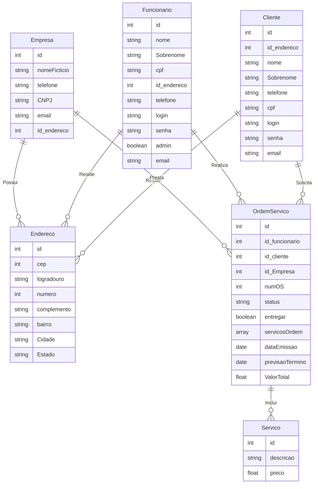

# Projeto-Sistema-LavaJato
PW1 projeto

# Diagrama do banco

```mermaid
erDiagram
  Empresa ||--o{ Endereco : Possui
  Empresa {
      int id
      string nomeFicticio
      string telefone
      string CNPJ
      string email
      int id_endereco
  }
  Funcionario ||--o{ Endereco : Reside
  Funcionario {
      int id
      string nome
      string Sobrenome
      string cpf
      int id_endereco
      string telefone
      string login
      string senha
      boolean admin
      string email
  }
  Cliente ||--o{ Endereco : Reside
  Cliente {
      int id
      int id_endereco
      string nome
      string Sobrenome
      string telefone
      string cpf
      string login
      string senha
      string email
  }
  Endereco {
      int id
      int cep
      string logradouro
      int numero
      string complemento
      string bairro
      string Cidade
      string Estado
  }
  Empresa ||--o{ OrdemServico : Presta
  Funcionario ||--o{ OrdemServico : Realiza
  Cliente ||--o{ OrdemServico : Solicita
  OrdemServico {
      int id
      int id_funcionario
      int id_cliente
      int id_Empresa
      int numOS
      string status
      boolean entregar
      array servicosOrdem
      date dataEmissao
      date previsaoTermino
      float ValorTotal
  }
  OrdemServico ||--o{ Servico : Inclui
  Servico {
      int id
      string descricao
      float preco
  }
```
