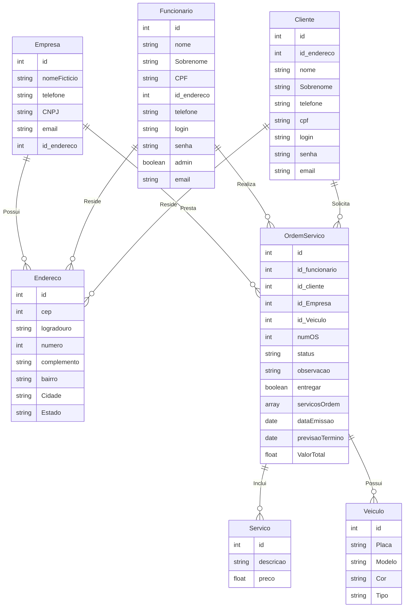

# Projeto Sistema LavaJato

Este projeto foi desenvolvido como trabalho final da disciplina de Programação para Web 1 na minha faculdade.

## Sobre o projeto 

O objetivo deste projeto é demonstrar o conhecimento adquirido na aplicação de padrões de projeto, como DAO e MVC. Os requisitos estabelecidos foram os seguintes:

* Utilização do padrão de arquitetura MVC;
* Implementação de páginas JSP para a camada de visualização;
* Proibição do uso de scriptless ou expressões nas páginas JSP;
* Adoção do padrão de projeto DAO para manipulação de dados;
* Utilização de banco de dados relacional para persistência dos dados;
* Gerenciamento de usuários logados por meio de sessões.

Em conformidade com essas exigências, as regras de negócio e o escopo do projeto foram definidos com base no meu entendimento.

Para este projeto Java EE, foram utilizados Glassfish, Maven e PostgreSQL como banco de dados. É importante observar que, embora tenha sido desenvolvido de maneira síncrona, essa abordagem foi solicitada pelo professor responsável.

## Banco de dados
O script utilizado para criar o banco de dados pode ser encontrado [aqui.](https://github.com/raunerlucas/Projeto-Sistema-LavaJato/blob/main/DataProj/scriptBanco.txt)

O modelo do banco de dados segue a seguinte estrutura:

## Diagrama de Classes

O diagrama de classes utilizado como referência está disponível [aqui](https://github.com/raunerlucas/Projeto-Sistema-LavaJato/blob/main/DataProj/diagrama.png)

## Imagens do sistema

A seguir, algumas imagens do projeto:
[Assista o video aqui.](https://drive.google.com/file/d/1kxunj9MVoF_RZR-oIJ9ZNIqEqesnrdX7/view?usp=sharing)

    